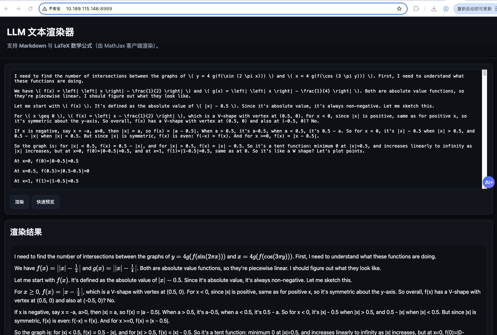

# LLM Text Renderer (Markdown + LaTeX)

A minimal web application built with **Python + Flask** to safely render text generated by large language models, supporting both Markdown and LaTeX mathematical formulas (rendered client-side via MathJax). Supports both `$` and `\[,\]` formula delimiters.

## Features
- Input/paste text in the left editor, preview rendered results on the right
- Server-side uses `Markdown` to convert Markdown to HTML
- Uses `bleach` whitelist sanitization to reduce XSS risks
- Uses `MathJax v3` to render `$...$` (inline) and `$$...$$` (block) math formulas in the frontend
- Provides `POST /api/render` JSON API for easy integration with your LLM service

## Local Setup & Quick Start

```bash
# python -m venv .venv
# source .venv/bin/activate  # Windows: .venv\Scripts\activate
pip install -r requirements.txt
python app.py
```

Visit: <http://127.0.0.1:5000/>

## Demo



## Integration with Your Backend (Optional)

If you have a backend that generates LLM output, you can submit the raw text to:

```
POST /api/render
Content-Type: application/json

{"text": "Markdown/LaTeX text generated by the model ..."}
```

Response:

```json
{"html": "<p> ... sanitized safe HTML ... </p>"}
``` 

You can directly place this `html` in your page (e.g., in a `<div>`), and MathJax will automatically render the math formulas.

## Security Notes

- This example uses `bleach` for HTML whitelist sanitization to reduce XSS risks; adjust `ALLOWED_TAGS` and `ALLOWED_ATTRS` according to your business needs.
- MathJax only processes math delimiters in text (like `$...$`, `$$...$$`) and does not execute scripts.
- If allowing external images or data URLs, ensure the sources are trusted.

## Deployment Recommendations

- Dockerized deployment (example provided)
- Reverse proxy (Nginx/Caddy) with HTTPS enabled
- Disable Flask `debug=True` for production (use gunicorn/uwsgi instead)

### Sample Dockerfile (Optional)

```dockerfile
FROM python:3.11-slim
WORKDIR /app
COPY requirements.txt ./
RUN pip install --no-cache-dir -r requirements.txt
COPY . .
ENV PYTHONDONTWRITEBYTECODE=1
ENV PYTHONUNBUFFERED=1
EXPOSE 5000
CMD ["python", "app.py"]
```

---

Feel free to extend as needed: add user authentication, history saving, file uploads, server-side persistent storage, etc.

# Authors
ThisIsSoMe & GPT5